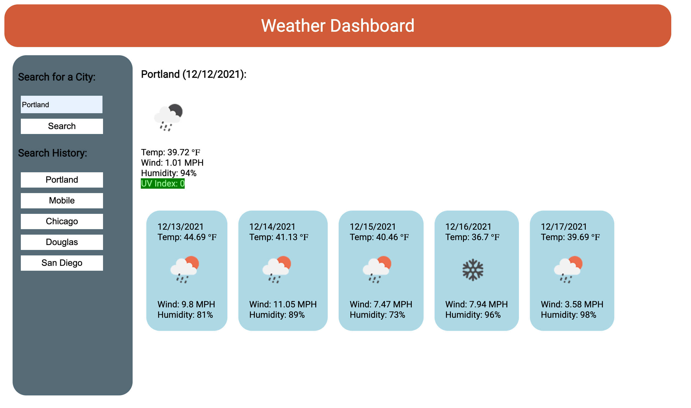

# Weather Dashboards
  
  

## Summary

This browser-based weather dashboard was built with vanilla JavaScript, CSS, HTML and the [Open Weather API](https://openweathermap.org/) as an exercise in using server-side APIs. 

The application features a current weather display, five-day forecast and persistent search history with local storage.

## Deployment
https://katiechurchwell.github.io/weather-dashboard/

## Screenshot

## Questions
  If you have any questions about this project, please open an issue or use the contact information below:
  * [katiechurchwell](https://www.github.com/katiechurchwell)
  * [churchwellcatherine@gmail.com](mailto:churchwellcatherine@gmail.com)

---
  